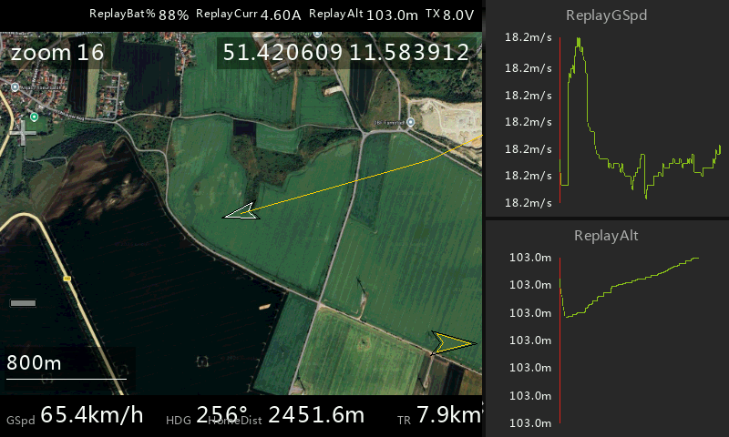
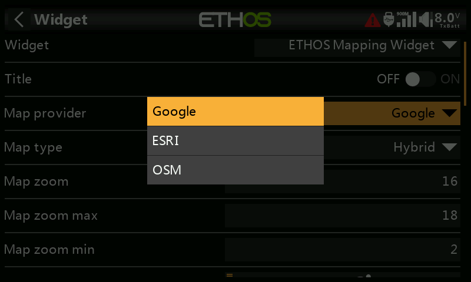
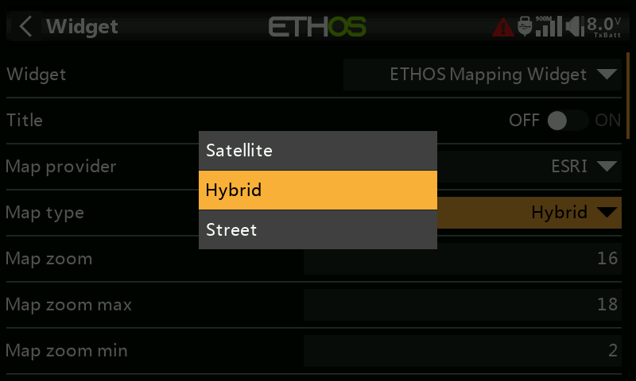
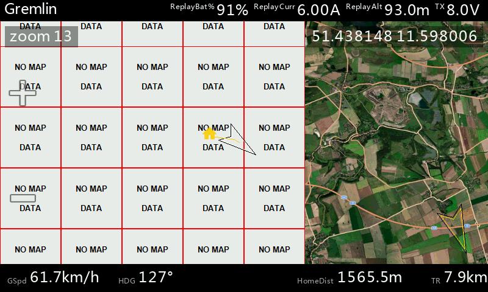

# Widget Overview

This guide describes the user interface of the ETHOS Mapping Widget: what you see on screen, how to interact with it, and how to configure it.

> Screenshots below may not reflect the latest version. They will be updated over time.

## Map Screen

The map screen is the main view of the widget. It shows a live satellite map centered on your UAV position with telemetry information and on-screen controls.

### Top Bar

The top bar displays:

- **Model name** (left) — your ETHOS model name
- **Custom telemetry sensors** (right) — up to 3 user-configurable sensors plus a dedicated link quality / RSSI slot and the transmitter voltage

The sensors shown in the top bar are assigned in the widget settings (see [Settings](#settings) below).

### Bottom Bar

The bottom bar shows calculated values derived from GPS telemetry:

| Label      | Description                              |
|------------|------------------------------------------|
| **GSpd**   | Ground speed                             |
| **HDG**    | Heading / course over ground in degrees  |
| **HomeDist** | Distance to home position              |
| **TR**     | Total travel distance since arming       |

Units are configurable in the widget settings.

### On-Screen Controls

| Control    | Location     | Function                                             |
|------------|--------------|------------------------------------------------------|
| **+** button | Left edge, top | Zoom in                                           |
| **−** button | Left edge, bottom | Zoom out                                      |
| **Lock** button | Left edge, middle | Toggle follow-lock (map tracks UAV or stays detached) |
| **Pin** button | Left edge | Place or remove an observation marker on the map    |

The current zoom level is shown in the top-left corner of the map.

### Map Elements

- **UAV icon** — shows the vehicle's current position and heading. Three symbol styles are available: Arrow, Airplane, and Multirotor (configurable in settings).
- **Home marker** — shows the home position (set automatically on arming or manually via menu).
- **Home direction indicator** — an arrow at the edge of the map pointing toward home when home is off-screen.
- **Trail** — a yellow line tracing the flight path. Trail resolution and bend sensitivity are configurable.
- **Scale bar** — bottom-left corner, shows the current map scale.
- **GPS coordinates** — displayed on screen in decimal or DMS format (configurable).
- **Observation marker** — a user-placed pin for marking a point of interest on the map.
- **Waypoint overlay** — INAV mission waypoints and flight path, if waypoint download is enabled (see [Waypoint Mission](WaypointMission.md)).

### Map Panning (Fullscreen Only)

In fullscreen mode, you can drag the map to explore the area around the UAV. The map enters detached mode and stops following the aircraft. After releasing, the map holds position briefly before re-centering.

For full details, see [Panning & Observation Marker](PanningAndMarker.md).

### Split-Screen and Small Widgets

The widget adapts to any size. In smaller widget sizes, the top and bottom bars are automatically hidden to maximize map area. On-screen buttons scale down accordingly.

## Context Menu

Long-press (or use the ETHOS menu button) to open the widget's context menu. Available actions depend on whether a GPS fix is active:

| Action                    | Description                                                  |
|---------------------------|--------------------------------------------------------------|
| **Maps: Reset**           | Clears trail, reloads tiles, and re-downloads waypoints      |
| **Maps: Set Home**        | Sets the home position to the current UAV location           |
| **Maps: Set Default Position** | Saves the current position as the default map center when no GPS is available |
| **Maps: Zoom in**         | Increase zoom level by one step                              |
| **Maps: Zoom out**        | Decrease zoom level by one step                              |

> "Set Home" and zoom actions are only shown when a GPS fix is available.

## Map Providers and Types

The widget supports multiple map tile providers. Available providers and map types depend on which tiles you have downloaded to the SD card.

| Provider   | Map Types Available           |
|------------|-------------------------------|
| **Google** | Map, Satellite, Hybrid, Terrain |
| **ESRI**   | Satellite, Hybrid, Street     |
| **OSM**    | Street                        |

The widget also supports legacy Yaapu tile folders as a read-only fallback. If you have existing Yaapu tiles, they are detected and used automatically without any file changes.

### Missing Tiles

When tiles are not available for the current area or zoom level, a "NO MAP DATA" placeholder is shown in place of the missing tiles.

## Settings

Open the widget settings through **System → Widgets → ETHOS Mapping Widget**. All settings are saved per widget instance.

### Map Settings

| Setting           | Description                                      | Default     |
|-------------------|--------------------------------------------------|-------------|
| Map provider      | Tile provider (Google, ESRI, OSM)                | Google      |
| Map type          | Map type for the selected provider               | Satellite   |
| Map zoom          | Default zoom level on startup                    | 18          |
| Map zoom max      | Maximum allowed zoom level                       | 20          |
| Map zoom min      | Minimum allowed zoom level                       | 1           |

### Features

| Setting                  | Description                                                                                | Default |
|--------------------------|--------------------------------------------------------------------------------------------|---------|
| Waypoint download (INAV) | Automatically download and display INAV missions via MSP (SmartPort, Crossfire, ELRS)      | On      |
| Zoom control             | Control zoom via RC channel: Off, 3-Position switch, or Proportional                       | Off     |
| Zoom channel             | RC channel number (1–64) for zoom input (only when zoom control is enabled)                | 0       |

### Top Bar Telemetry

| Setting              | Description                                                   | Default |
|----------------------|---------------------------------------------------------------|---------|
| Link quality source  | Telemetry source for LQ/RSSI display in the top bar           | —       |
| User sensor 1        | Custom telemetry source shown in the top bar                  | —       |
| User sensor 2        | Custom telemetry source shown in the top bar                  | —       |
| User sensor 3        | Custom telemetry source shown in the top bar                  | —       |

### Units

| Setting                   | Options                    | Default |
|---------------------------|----------------------------|---------|
| Airspeed/Groundspeed unit | m/s, km/h, mph, kn         | m/s     |
| Vertical speed unit       | m/s, ft/s, ft/min          | m/s     |
| Altitude/Distance unit    | m, ft                      | m       |
| Long distance unit        | km, mi                     | km      |
| GPS coordinates format    | DMS, Decimal               | Decimal |

### Display

| Setting              | Options                         | Default |
|----------------------|---------------------------------|---------|
| Vehicle symbol       | Arrow, Airplane, Multirotor     | Arrow   |
| Trail resolution     | Off, 20m, 50m, 100m, 500m, 1km  | 50m     |
| Trail bend threshold | 3–15 degrees                    | 5°      |

### Telemetry Source

| Setting              | Description                                                         | Default |
|----------------------|---------------------------------------------------------------------|---------|
| Telemetry source     | ETHOS (built-in GPS) or Sensors (user-assigned sources)             | ETHOS   |
| GPS Lat source       | Source for GPS latitude (Sensors mode only)                         | —       |
| GPS Lon source       | Source for GPS longitude (Sensors mode only)                        | —       |
| Heading source       | Optional heading/yaw source (Sensors mode only)                     | —       |
| Speed source         | Optional ground speed source (Sensors mode only)                    | —       |

> Sensors mode is intended for advanced setups where the default ETHOS GPS source is not suitable.

### Debug & Developer

| Setting              | Description                                                  | Default |
|----------------------|--------------------------------------------------------------|---------|
| Enable debug log     | Writes a debug log to the SD card during runtime             | Off     |
| Enable perf profile  | Emits 5-second performance summaries into the debug log      | Off     |

These options are for troubleshooting and development only. They increase SD card writes and should be disabled during normal use.
