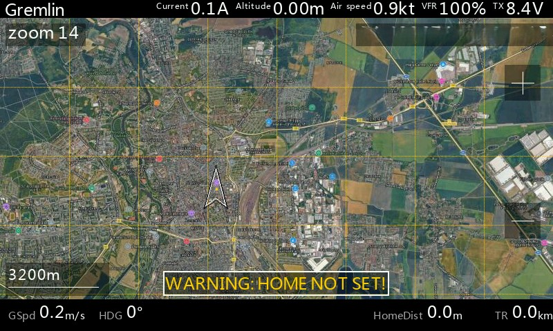
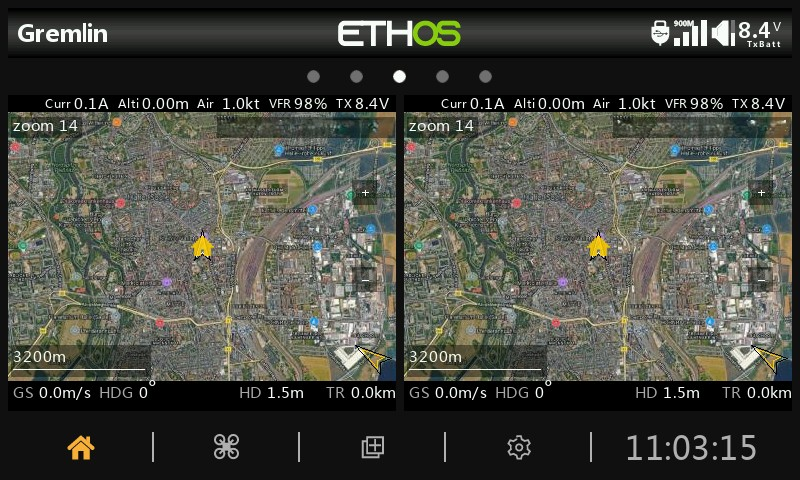
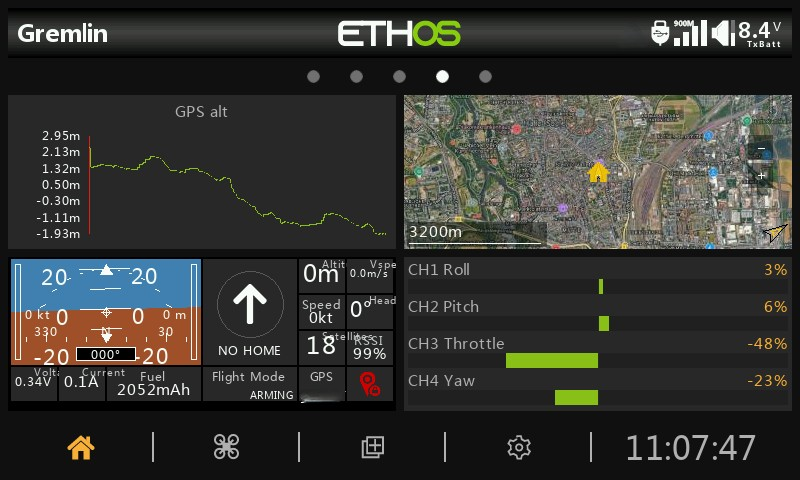

# EthosMappingWidget

**Scalable Mapping Widget for Ethos OS**

A modern, fully scalable version of the popular Yaapu Mapping Widget for FrSky Ethos.  
It displays your real-time GPS position on a supported map type of your choice and works perfectly on **any** widget size — from Fullscreen down to very small custom layouts.

## Download
- Releases and Pre-Tested Beta-Versions can be downloaded from https://github.com/b14ckyy/ETHOSMappingWidget-Revisited/releases
- If you want to try out the latest running development version, download from the `main` branch directly (usually working fine but just roughly tested).
- other branches are in active development and should not be used and no feedback to these will be accepted.

## Features

- Real-time moving map with satellite imagery
- Dynamic zoom levels (manual via touch or buttons)
- UAV position marker with heading
- Home position marker and Home Arrow
- Scale bar with distance indication
- Trail history
- Visual Zoom Buttons (+ / -) on the right edge
- Works in Fullscreen, Split-Screen and all custom widget sizes
- **One mapping widget per screen** (multiple instances on the same screen are not supported)
- Optimized tile loading and performance







## Installation

### Quick Start (Works with Existing Yaapu Tiles!)

1. Download the repository to your PC
2. Copy the `scripts` and `bitmaps` folders (from `RADIO`) to your SD card or Radio storage
3. Restart your radio completely
4. Add the widget to any screen

**That's it!** If you already have Yaapu map tiles, the widget automatically finds and uses them.

If you want to generate new native EthosMaps tiles, use the downloader linked below.

### Folder Structure Expected

```
RADIO/ or SD/
├── scripts/
│   └── ethosmaps/          ← all .lua files (copy as-is)
│       ├── lib/            ← helper libraries
│       ├── audio/          ← notification sounds (optional)
│       └── main.lua        ← main widget code
└── bitmaps/
    ├── ethosmaps/
    │   ├── maps/           ← new native EthosMaps tiles
    │   └── bitmaps/        ← widget graphics
    └── yaapu/              ← existing Yaapu tiles (auto-detected & used)
        └── maps/           ← your GMapCatcher / Google tiles
```

**Important Notes:**
- Script and Map Tiles must be on the same drive (Radio or SD) as your other scripts
- Existing Yaapu tiles in `/bitmaps/yaapu/maps/` are automatically discovered and used
- No need to reorganize or duplicate tiles if you already use Yaapu
- New EthosMaps tiles can be added anytime — seamless mixing with Yaapu tiles 

## Recommended Tile Downloader

For new map tiles, use only:

- Repository: https://github.com/MartinovEm/High-Resolution-Map-Generator
- Online tool: https://martinovem.github.io/High-Resolution-Map-Generator/

This is the recommended and supported way to generate tiles for this widget.

### Quick Native Tile Workflow

1. Open the online tool or the downloader from the repository.
2. Set **Output Target** to `b14ckyy ETHOS Mapping Widget`.
3. Choose the provider, map type, and zoom range.
4. Search your flying field or pan manually to the target area.
5. Draw a rectangle around the area you want to export.
6. In Chrome/Edge, link the **root directory** of your SD card or radio storage. If direct access is not available, use ZIP download as fallback.
7. Export the tiles. The downloader creates and syncs the correct target path automatically.

The downloader handles the correct folder naming and path layout automatically. Full details remain in the downloader project itself.

## Usage

- Touch buttons on the left side to zoom in/out
- The map centers automatically on the current UAV position
- The Home Arrow shows the direction and distance to home
- The Scale Bar shows the current map scale
- Basic Telemetry widgets at the Bottom show GroundSpeed, Heading, DistanceToHome and TravelDistance
- Customizable widgets (up to 4) at the top including one specifically for LQ or RSSI and Transmitter Voltage

## Seamless Multi-Source Tile Support: EthosMaps + Yaapu

This widget supports a **fully transparent fallback system** that allows you to use existing Yaapu tile layouts alongside new native EthosMaps providers. Whether you're sharing map tiles with Yaapu Telemetry or gradually migrating to EthosMaps, the system handles it seamlessly.

### How It Works

**Tile Loading Priority (Automatic):**

1. **Primary (EthosMaps)**: Try native EthosMaps folder structure first
   - Supports multiple providers: `GOOGLE`, `ESRI`, `OSM`, etc.
   - Each provider offers independent map types
   - Latest provider technology

2. **Fallback (Yaapu Paths)**: If EthosMaps tiles not found (only Google), automatically load from Yaapu structure, if available
   - GMapCatcher: Works with existing Yaapu `/bitmaps/yaapu/maps/` layout but is not natively supported in `ethosmaps` path
   - Google: Falls back to legacy Yaapu Google map folders
   - Seamless integration — **users don't notice the switch**

3. **Result**: Mix EthosMaps and Yaapu tiles on the **same map**, or use pure Yaapu layouts

### Practical Scenarios

**Scenario 1: Existing Yaapu User**
- Your Yaapu Telemetry has GMapCatcher tiles in `/bitmaps/yaapu/maps/`
- Just add the EthosMappingWidget to your radio
- It automatically finds and uses your existing tiles
- **No tile duplication or file movement needed**

**Scenario 2: Gradual Yaapu → EthosMaps Migration**
- Start downloading EthosMaps GOOGLE tiles to `/bitmaps/ethosmaps/maps/GOOGLE/`
- Widget loads EthosMaps tiles where available
- Falls back to Yaapu tiles for gaps
- No downtime during transition

**Scenario 3: New EthosMaps-Only Setup**
- Use `/bitmaps/ethosmaps/maps/` exclusively
- Access new providers (ESRI, OSM) not available in Yaapu
- Better organization and performance

### Folder Structure & Naming

**EthosMaps (New Native Format):**
```
/bitmaps/ethosmaps/maps/
├── GOOGLE/
│   ├── Map/{z}/{x}/{y}.{jpg|png}
│   ├── Satellite/{z}/{x}/{y}.{jpg|png}
│   ├── Hybrid/{z}/{x}/{y}.{jpg|png}
│   └── Terrain/{z}/{x}/{y}.{jpg|png}
├── ESRI/
│   ├── Satellite/{z}/{y}/{x}.{jpg|png}
│   ├── Hybrid/{z}/{y}/{x}.{jpg|png}
│   └── Street/{z}/{y}/{x}.{jpg|png}
└── OSM/
    └── Street/{z}/{x}/{y}.{jpg|png}
```

**Coordinate rules currently used by the widget:**
- **Google / OSM:** `z/x/y`
- **ESRI:** `z/y/x`
- **Formats:** `.jpg` and `.png` are both supported (auto-detected per tile)

**Yaapu Google (Legacy Format - Read-Only Fallback):**

The widget automatically detects and loads existing Yaapu Google tiles in:
```
/bitmaps/yaapu/maps/
├── GoogleMap/{z}/{y}/s_{x}.{jpg|png}
├── GoogleSatelliteMap/{z}/{y}/s_{x}.{jpg|png}
├── GoogleHybridMap/{z}/{y}/s_{x}.{jpg|png}
└── GoogleTerrainMap/{z}/{y}/s_{x}.{jpg|png}
```

**Yaapu GMapCatcher (Legacy Format - Read-Only, Auto-Detected):**

If you have legacy Yaapu tiles from GMapCatcher, the widget automatically detects and reads:
```
/bitmaps/yaapu/maps/
├── sat_tiles/...
├── map_tiles/...
└── ter_tiles/...
```

**Note:** The widget reads existing Yaapu folders (Google and GMapCatcher) for backward compatibility and parallel use with legacy Yaapu Widgets. These are read-only fallback; new tiles go to native EthosMaps format (`/bitmaps/ethosmaps/maps/`) for best performance.

### Naming Conventions (Strict for Predictability)

- **EthosMaps provider folders**: FULL CAPS (`GOOGLE`, `ESRI`, `OSM`)
- **Map type folders**: Exact Title-Case per provider:
    - `GOOGLE`: `Map`, `Satellite`, `Hybrid`, `Terrain`
    - `ESRI`: `Satellite`, `Hybrid`, `Street`
    - `OSM`: `Street`
- **Yaapu folders**: Original Yaapu naming (automatically mapped for compatibility)
- **UI Display**: Provider names shown in readable format (`Google`, `ESRI`), but internal paths remain strict
- **Invalid selections**: If no tiles found, settings show `NONE` and dependent options are disabled

## Breaking Change (Important)

### New native folder layout for non-Yaapu tiles

This branch expects native EthosMaps tiles under:

`/bitmaps/ethosmaps/maps/<PROVIDER>/<MAPTYPE>/<z>/...`

If your tiles are **not** in Yaapu legacy folders and still use an older custom structure, they must be moved/reorganized to the paths shown above.

### What is NOT affected

- Existing Yaapu tiles in `/bitmaps/yaapu/maps/` are still supported.
- Google can still fallback to Yaapu Google folders when native EthosMaps Google tiles are missing.

### Migration guide for non-Yaapu tiles

1. Create provider folders: `GOOGLE`, `ESRI`, `OSM` under `/bitmaps/ethosmaps/maps/`.
2. Move each map type into the correct provider/type folder names (exact case).
3. Ensure coordinate layout matches provider rules:
    - Google/OSM: `/z/x/y.{jpg|png}`
    - ESRI: `/z/y/x.{jpg|png}`
4. Keep zoom levels as plain numeric folders (`z`).
5. After migration, open widget settings and verify provider/map type availability.

### Key Advantages

| Feature | EthosMaps | Yaapu (Fallback) |
|---------|-----------|------------------|
| Providers | GOOGLE, ESRI, OSM, others | GMapCatcher, Google only |
| Map organization | Per-provider folders | Single shared folder |
| New features | ✅ Supported | ❌ Limited |
| Existing Yaapu tiles | ✅ Automatic fallback | ✅ Native support |
| Mixed tile sources | ✅ Seamless | N/A |

## Unified Zoom Settings

Zoom configuration is unified across all map providers to keep the settings menu simple and consistent.

- `Map zoom`: default zoom level used when the map is initialized
- `Map zoom min`: lower zoom limit
- `Map zoom max`: upper zoom limit

Notes:

- Provider-specific zoom settings are no longer used.
- Existing installations are migrated automatically from legacy provider-specific zoom keys.
- If no valid provider or map type is available, the UI shows `NONE` and map-related selection fields are disabled.

## Custom Enhancements & Modifications

This version includes extensive custom improvements:
- Full dynamic scaling for any widget size (including Tiny and Ultra-Tiny modes)
- Smart element hiding (Top/Bottom bars, telemetry values, overlays) when space is limited
- Improved Scale Bar visibility and background
- Refined "Home Not Set" warning with dynamic box sizing
- Better performance and reduced tile loading in small widgets

## Credits

- Original concept and base code: Yaapu (Alessandro Apostoli)
- Heavy modifications and scalability enhancements: b14ckyy
