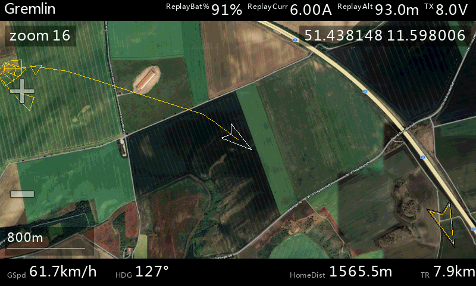

# EthosMappingWidget

**Scalable Mapping Widget for FrSky Ethos**

A modern, fully scalable version of the popular Yaapu Mapping Widget.  
Real-time GPS position on satellite or street maps — works on **any** widget size, from Fullscreen down to small custom layouts.

## Download

- **Releases:** https://github.com/b14ckyy/ETHOSMappingWidget-Revisited/releases
- **Latest dev version:** download from `main` branch (usually working, roughly tested)
- Other branches are in active development — do not use.

## Features

- **Moving map** — real-time UAV position with heading, home marker, home arrow, trail history and scale bar
- **Multiple map providers** — Google, ESRI, OSM with various map types (Satellite, Hybrid, Street, Terrain)
- **Touch zoom** — on-screen +/- buttons or hardware keys
- **Map panning** — drag to scroll, observation marker, detached mode ([details](Docs/manuals/PanningAndMarker.md))
- **INAV waypoint missions** — automatic MSP download, path overlay, active WP tracking via SmartPort or CRSF/ELRS ([details](Docs/manuals/WaypointMission.md))
- **Split-screen & custom layouts** — dynamic scaling, smart element hiding ([details](Docs/manuals/CustomLayouts.md))
- **Yaapu tile compatibility** — existing Yaapu tiles are auto-detected and used as fallback
- **Configurable telemetry** — top bar with up to 4 custom fields, bottom bar with speed/heading/distance
- **One widget per screen** (multiple instances on the same screen are not supported)

For a complete guide to the user interface, all settings, and the context menu, see the **[Overview](Docs/manuals/Overview.md)**.

## Installation

Copy the widget files to your radio, add map tiles, and configure — requires **ETHOS 1.6** or later.

For step-by-step instructions, folder structure, and map tile setup, see the **[Installation Guide](Docs/manuals/Installation.md)**.

### Map Tiles

Use the **[High Resolution Map Generator](https://martinovem.github.io/High-Resolution-Map-Generator/)** ([Repository](https://github.com/MartinovEm/High-Resolution-Map-Generator)) to download tiles. Set the output target to `b14ckyy ETHOS Mapping Widget` — the tool handles folder structure and naming automatically.

Recommended format: **JPG** for all radios. Existing Yaapu tiles (Google, GMapCatcher) are detected and used automatically without duplication.

## Documentation

| Document | Description |
|----------|-------------|
| [Installation Guide](Docs/manuals/Installation.md) | Setup, folder structure, map tiles, updates |
| [Overview](Docs/manuals/Overview.md) | User interface, all settings, context menu |
| [Map Tiles Guide](Docs/manuals/MapTilesGuide.md) | Providers, formats, folder structure, Yaapu fallback |
| [Panning & Marker](Docs/manuals/PanningAndMarker.md) | Map panning, observation marker, detached mode |
| [Waypoint Missions](Docs/manuals/WaypointMission.md) | INAV MSP waypoint overlay |
| [Custom Layouts](Docs/manuals/CustomLayouts.md) | Split-screen and custom widget sizes |
| [Troubleshooting](Docs/manuals/Troubleshooting.md) | Common problems and solutions |
| [Migration Guide](Docs/manuals/MigrationGuide.md) | Upgrading from 1.x to 2.0 |
| [Changelog](Docs/development/CHANGELOG.md) | Version history with all notable changes |

## Credits

- Original concept and base code: Yaapu (Alessandro Apostoli)
- Heavy modifications and enhancements: b14ckyy
